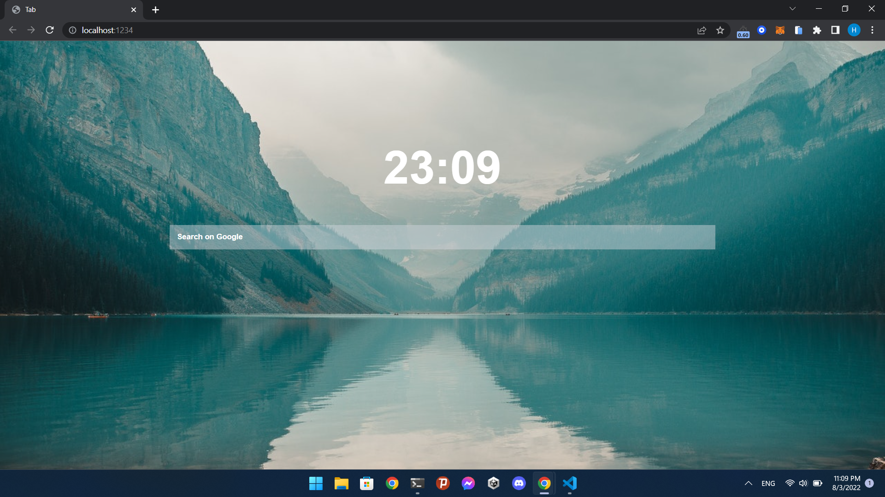

# Tab Theme For Chrome

> **Warning**
> This project is discontinued by author

<a href="https://github.com/happer64bit/CleanTab/releases">Download Extension here</a>

<a href="https://www.buymeacoffee.com/happer64bit" target="_blank"></a>

## Build
### You need to install npm and nodejs on your computer to bundle source code to use *or* download extension at releases
```bash
# To build
npm run build
```

> version 1.0.4

## ScreenShots


